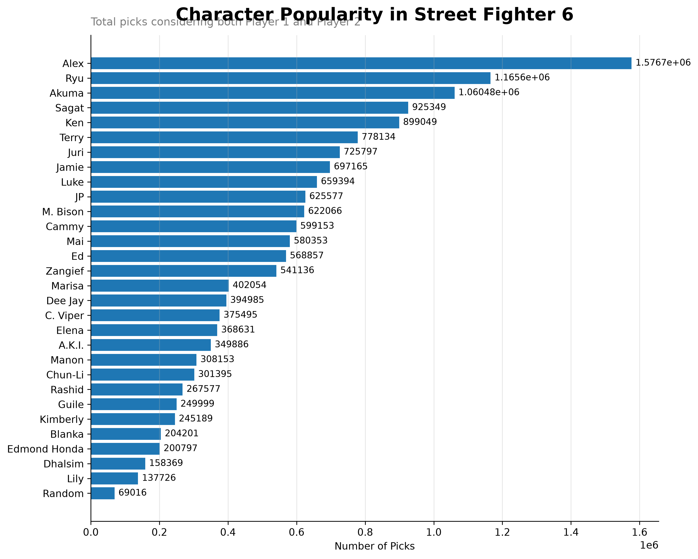
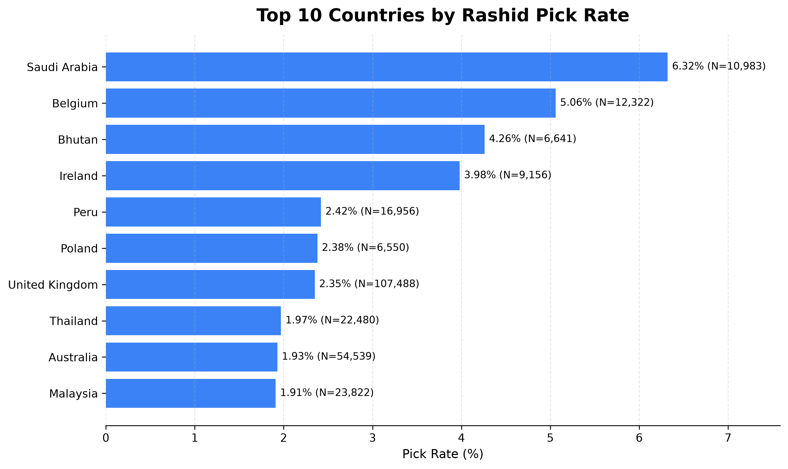
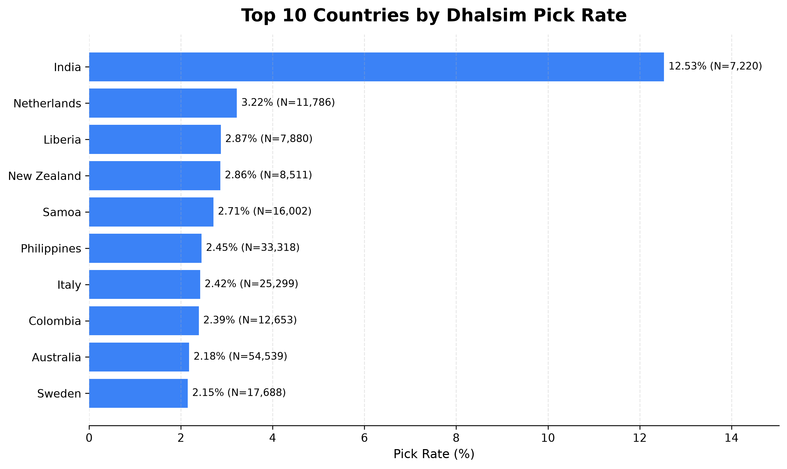
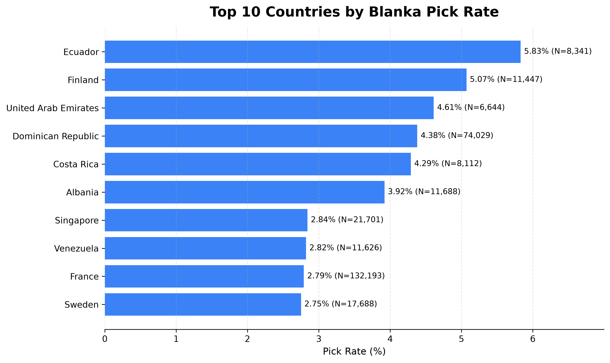
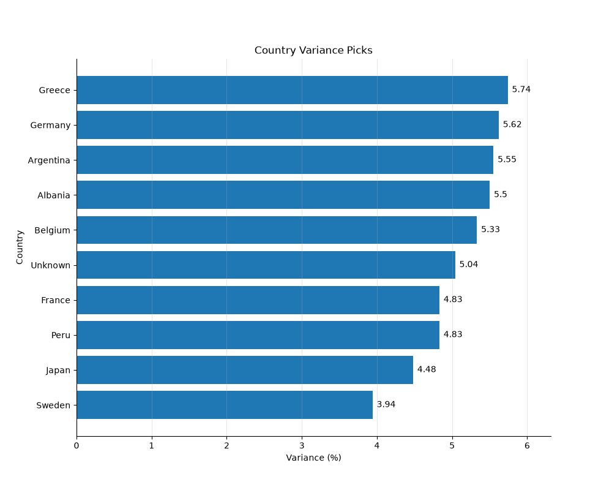
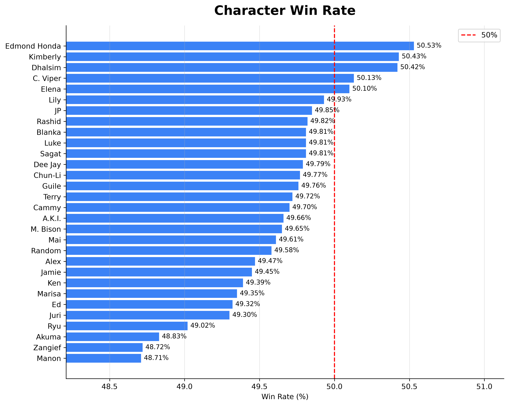
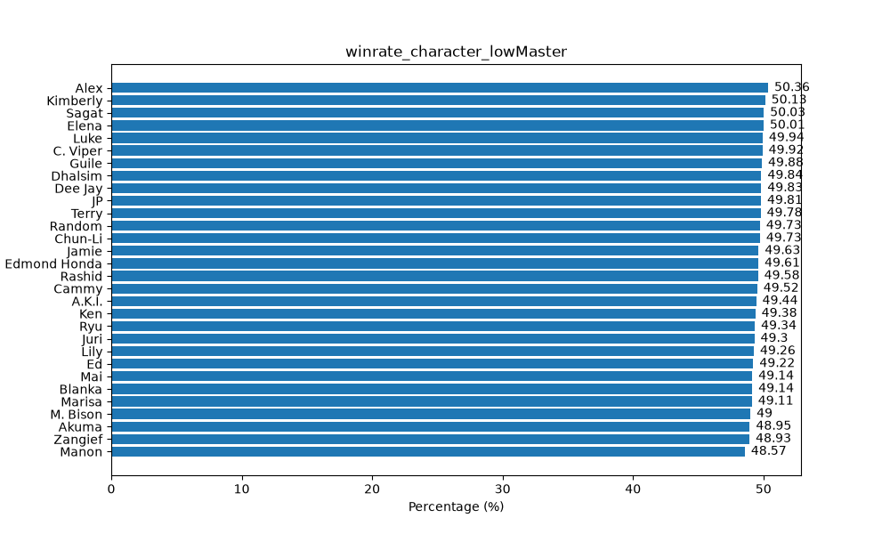
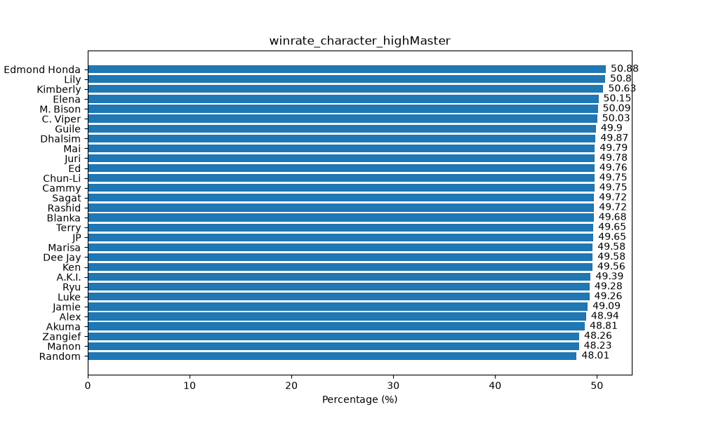
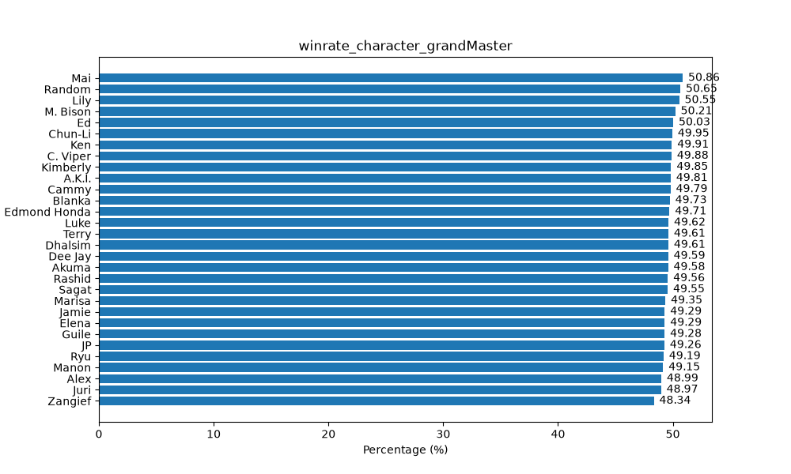
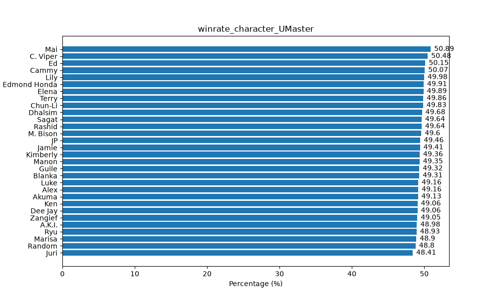

# Street Fighter 6 master rank analyzis

## Introdução:

    Street Fighter 6 é um jogo competitivo do gênero de luta esta análise é interessante, porque a nível casual e empresarial mostra tendências
    do produto ou ligações entre jogadores e personagens. Esta análise tem como objetivo investigar se dados de um ambiente competitivo
    podem revelar padrões de comportamento. Nesse sentido, os dados utilizados na análise foram retirados do site **kaggle** sobre o tamanho do conjunto
    é de aproximadamente 8 milhões de partidas, nesse conjunto encontrará dados que representam quantidade de mr (rank),
    quem venceu entre player 1 ou 2, origem do país e etc. Nas próximas seções explicarei de forma mais detalhada a análise de métricas, metodologias, visualizações
    e conclusões.

## Tecnologias Usadas:
 
- Pycharm
  - Python 3.14
  - Pandas
  - Matplotlib
  - SQlite
  - Git
  - Github 


## Installation

Clone o repositório:

```bash
git clone https://github.com/seuusuario/seu-projeto.git
```

Crie um ambiente virtual:

```bash
python -m venv .venv
```

Ative o ambiente virtual:

Linux/macOS

```bash
source .venv/bin/activate
```

Windows

```bash
.venv\Scripts\activate
```

Instale as depedências:

```bash
pip install -r requirements.txt
```

## Dataset:
    O dataset obtido no kaggle de período 2026-03-17 -> 2026-04-27, contém o resultado de 8 milhões de partidas do jogo street fighter 6 no rank master o autor é o "data ken".
    Cada linha do dataset tem um ID único do replay, o Unix time de quando a partida foi terminada, o resultado e as informações
    referentes a players 1 e 2. Cada player possui uma escolha de personagem, MR naquela partida, plataforma região e título. O grande volume de partidas permite a observação
    de tendências e reduzir o impacto de casos isolados.

    link: https://www.kaggle.com/datasets/kenssfdata/sf6-masters-matches


## Metodologia:

### Processamento de dados:
    Os dados já vieram semi-processados do kaggle, apenas garanti que os dados não foram
    duplicados e a importação no banco de dados SQLite.

### character popularity:
    É o número total de seleções de um personagem considerando em ambas colunas p1_char e p2_char.

### character popularity by country:
    É a quantidade relativa de seleções de um personagem em porcentagem naquele país.

### Country diversity
    É a variância da quantidade relativa de personagens em um país.

### Character win rate:
    É a relação entre a quantidade de partidas totais de um personagem e sua quantidade de partidas vencidas.

### Character win rate by mr:
    É a relação entre a quantidade de partidas totais de um personagem e sua quantidade de partidas vencidas em um recorte de mr.

## Análise:


### character popularity:



  No gráfico apresentado é possivel ver que grande parte das seleção é
  do personagem Alex, o que indica uma possível tendência de picks pelo período
  de quando os dados foram colhidos perto de seu lançamento. Ademais, temos personagens
  que são menos populares como lily, Blanka e Dhalsim esses personagens tem opniões diversas
  dos jogadores alguns falam que poderia ser por causa do desing outro por gameplay contudo, há uma
  caracteristícas importante sobre um deles que será falada adiante.

### character popularity by country:



  Essa medida como foi dito anteriormente mostra o quanto o personagem é selecionado em um certo país. Nessa lógica, 
  verifica-se no gráfico acima e posteriores relações interessantes. O gráfico acima mostra o personagem Rashid, e seus países
  10 países mais selecionados, dados mostrados em porcentagem ou seja, de forma relativa e proporcional. A relação dita 
  anteriormente é sobre o seu país de origem dentro do jogo (Arábia Saudita) e o país onde ele é mais selecionado no conjunto
  de dados em que nesse caso Arábia Saudita é o primeiro colocado mostrando evidências de que há a possibilidade dos jogadores sauditas
  tenham identificação com o personagem.



  O caso de Dhalsim não é tão diferente do de Rashid, contudo é notório sua popularidade em Índia visto que no conjunto de 
  dados e por pesquisas na internet ele é um dos personagens menor popularidade do jogo. Nesse sentido, existe a hipótese
  de que não é sobre seu design e sim de como ele se comporta no jogo visto que, a gameplay de Dhalsim requer mais paciência
  e controle de espaço.



  Blanka é um caso diferente dos anteriores o Brasil não aparece entre os mais selecionados, entretanto existe uma relação
  que pode ser observada ao investigar o gráfico. A quantidade de seleções de Blanka de República Dominicana é alta ocupando assim,
  o quarto lugar do país mais selecionou Blanka. A hipótese levantada que poderia responder isso seria o alto nível do jogo por causa,
  sendo mais específico do mais popular, considerado por muitos o mais forte jogador atual Menard em que não é só forte dentro de jogo
  aumentou também a força do seu país nos fighting games é uma possível explicação do porquê que as pessoas utilize seu personagem principal atual.

#### Nota:
  
    Existem outros personagens que tiveram destaque em seus países de origem como Zangief mas não há nada a ser comentado a mais comparado a 
    Rashid e Dhalsim.


### Country diversity:

 Pensando sobre a análise anterior, sobre o país de pertencimento dos personagens fora do mundo do jogo, percebi um padrão: 
 alguns países com quantidade de partidas mais elevada não apareciam na análise anterior ou apareciam com pouca frequência. 
 Então, levantei a hipótese de que esses países são equilibrados em seleções de personagens, ou seja, não existia um personagem claramente dominante. 
 A precisão dessa análise pode ser comprometida por causa de alguns dados conhecidos como "unknown", nos quais não foi possível 
 a extração do local de origem da partida.



  O gráfico acima mostra os 10 paíse que menos tem variância entre a média de seleção de cada personagem. Percebe-se que, 
  Japão está no nono lugar o que indica uma evidência não corrobora em relação a hipotese levantada visto que, em análises inclusive
  da própria capcom e da forma como a cultura dos fliperamas foi fundamentada no Japão esperava-se uma colocação maior devido a 
  a sua grande quantidade de players podendo ter maior variedades de picks. Em relação aos outros países que estão sendo exibidos
  como Grécia aparecendo em primeiro pode haver duas possibilidade plausíveis a quantidade de players necessariamente não está
  relacionada a variedade de escolhas de cada personagem ou simplesmente quantidade de dados do conjunto não pode dar uma avalia-
  ção precisa.

### Character win rate by mr:

Essa sessão surgiu devido a própria percepção de uma discussão frequente na comunidade de jogos, principalmente jogos de luta
quanto a força do personagem afeta o desempenho dentro de jogo sendo esse medido em taxa de vitória e no caso da análise feita
no master em mr.




  Em primeira instância, nós temos a taxa de vitória de cada personagem de forma bruta desconsiderando qualquer intervalo
  de habilidade ou recorte de elo. A partir disso, podemos verificar no gráfico que o personagem que lidera o ranking de 
  taxa de vitória é Edmond Honda o que é bastante inesperado mas, há hipóteses para isso Honda não é um personagem muito 
  selecionado fazendo com que os players do jogo não tenham muito contato com ele. Contudo, ainda é notório que as taxas
  de vitórias de todos personagens não são tão distantes não tem uma variação alta o que dá evidências para tomar certas
  conclusões.











Os gráficos apresentados são a winrate de cada recorte de elo sendo low master 1500 abaixo, high master entre 1500 e 1600,
grand master entre 1600 e 1700 e por último ultimate master de 1800+. Nota-se que ao observar o gráfico e tomar como exemplo
a personagem Mai Shiranui considerado por muitos a mais forte do jogo os gráficos mostram apesar de pouca variação de winrate
mostra que a winrate da personagem aumenta conforme o nível do elo evolui indicando um possível evidência da influência do nível 
do jogador na personagem.


## Conclusões:

O objetivo desse projeto foi observar se em um ambiente competitivo pode revelar tendências entre jogadores e jogodores.
A partir de aproximadamente 8 milhões de partidas foi possível extrair tendências interessantes relacionado a popularidade
dos personagens, diferenças geográficas e desempenho por faixa de mr. As análises mostraram evidências de que alguns personagens possuem maior identificação em seus países de origem, 
como Rashid e Dhalsim, enquanto outros apresentaram comportamentos que podem estar relacionados à influência de jogadores profissionais, como no caso de Blanka. 
Além disso, verificou-se que a maioria dos personagens possui taxas de vitória próximas de 50%, sugerindo um bom equilíbrio geral do jogo. Entretando, 
ao analisar a taxa de vitória por faixa de mr, observou-se que alguns personagens por mais que variações menores de taxa de vitória
sejam baixas apresentam melhor desempenho em rankings superiores indicando que o potencial do personagem pode depender da 
capacidade do jogador. Apesar do resultados, esta análise possui limitações. O conjunto de dados apresenta apenas jogadores
do rank master em período especifíco do jogo, alguns dados que foram extraídos relacionados a nacionalidade não foi possível
atribuir a nacionalidade do jogador a partida por isso "Unknow", o que pode influenciar as métricas apresentadas.
Adiante, seria interessante expandir a análise em diferentes temporadas, patchs ou investigar outros aspectos do jogo
como a preferência de arquétipos do jogo ou até mesmo a influêcia do competitivo sobre a popularidade dos personagens.
De forma geral, esse projeto demonstrou como técnicas de análise de dados podem ser utilizados para extrair informações
relevates em ambiente competitivo, transformando um grande volume de partidas em evidências capazes de auxiliar tanto 
jogadores quanto estudos sobre o comportamento da comunidade.


  


  


    
    
    
    
    
    


    


 
    


